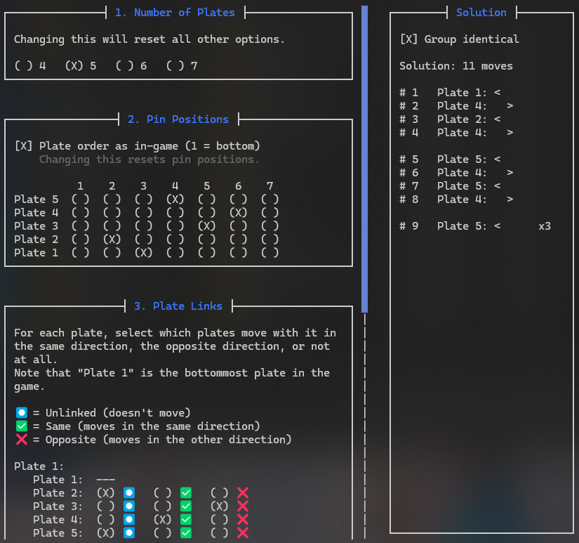

# Gothic 1 Remake Lock Solver

> [!NOTE]
> This work is licensed under [*CC BY-NC-ND 4.0*](https://creativecommons.org/licenses/by-nc-nd/4.0/). 
> This means you can share this program, provided you state where you got it from (attribution). You cannot distribute
> modified copies of this program or use this program or parts of it for commercial purposes.

> [!IMPORTANT]
> **Yes**, it is a command line application.
> **No**, you don't have to be a tech-wizard to use it.
> **You can simply use your mouse to use this application.**
>
> A version with graphical user interface is being worked on.

  

    

 

## Content

1. [Installation](#installation)
2. [Usage](#usage)

## Installation

No installation is required. Simply grab your exe from the
[release page](https://github.com/crowbait/gothic-remake-lock-solver/releases) and run it.

> [!WARNING]
> This application works best in the "new" *Windows Terminal*. 
> Windows 11 users don't need to do anything. 
> *However*, if you are still on Windows 10, you should install and use the official
> *Windows Terminal*, following [the instructions](https://learn.microsoft.com/en-us/windows/terminal/install). You only
> need to do the first 2 steps, "install" and "setting default".

## Usage

> [!NOTE]
> To scroll using the mouse wheel, place your curser *on the scrollbar*.

1. Select the number of plates the lock has. *Changing this later will reset all other inputs.*
2. Select the position of pins for each plate. Plate 1 is always the bottom plate in-game. *Note that by default, the
   bottom-most plate in the interface is 1, making the order the same as in-game.*
3. Set links: move each plate and check which *other* plates don't move at all ("unlinked"), move in the same direction
   as the plate you are currently moving ("same") or in the other direction ("opposite).
4. Click `<Solve>` (bottom-right) and follow the steps.
